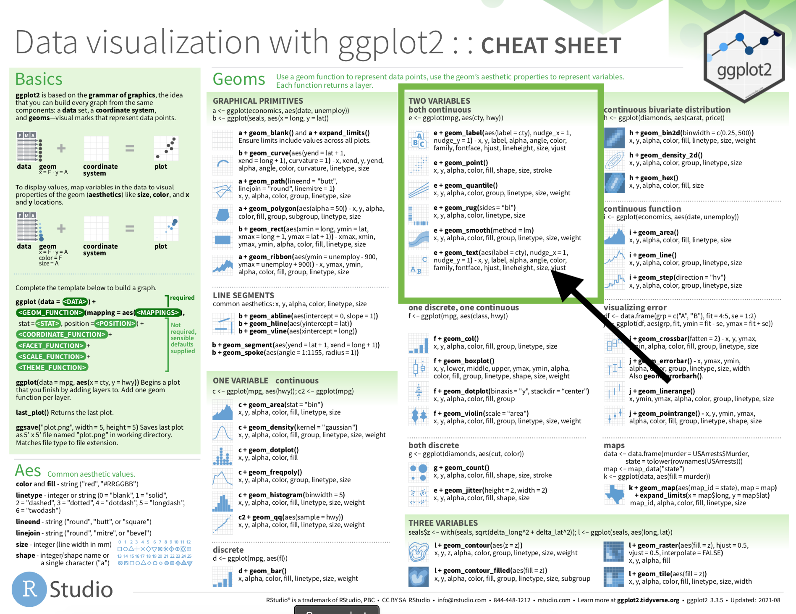

```{r setup, include=FALSE}
library(learnr)
library(ggplot2)
knitr::opts_chunk$set(echo = FALSE)
```


## Creating data objects

One of the coolest aspects of programming is the ability to create and innovate. You are not restricted to templates or pre-selected options. 


In R, we create new objects using the assignment operator (`<-`). When reading code, the assignment operator is read as "gets the value of". For example, `x <- 2` is read as "x gets the value of two".

## Why create a data object?  

Data objects make life easier. Imagine if we had to type out the values of every variable in a dataset before we could plot it or calculate a mean. We would never get anything done. In R, we can use data objects to store store all kinds of things, including entire plots. One reason we might store a plot is that we want to make lots of plots that share some code. Rather than write out the same lines repeatedly, we save the portion of code that is shared and add on the unique parts. 

You have seen this strategy before in the `ggplot2` cheatsheet. 

{ width=100% }

<br>

Find the section dedicated to plotting two continuous variables. Notice the code at the beginning of the section:

```
e <- ggplot(mpg, aes(cty, hwy))
```
If we try to run this code, we will probably be disappointed because it will look like nothing happened. The only thing R will output is the code itself. The reason that we do not see any other output is that R does not print out anything to the screen when new objects are created.

We have to run the object name (`e`) to see what is stored.

```{r view_e, exercise = TRUE}

e <- ggplot(mpg, aes(cty, hwy))

e
```


This plot shows a blank grid with the variable names `cty` and `hwy` on their respective axes, but we cannot see any values. R knows that there are values in those variables; that is how it picked the numbers on the x and y axes. 

What do we need to do in order to see the data values on the plot? 

```{r ggplot-geom-quiz}
quiz(
  question("We will not see any points, bars, lines, boxplots, or anything else on our plot called 'e' until we",
    answer("specify a geom.", correct = TRUE),
    answer("restart our R session."),
    answer("pick a different set of variables.")
  )
)
```


## Storing data objects  {data-progressive=TRUE}

Let's say that I want to plot a variable that I do not have in my dataset, but I can calculate using the information that I already have. 

Look through the `mpg` dataset. 

```{r view-mtcars, exercise = TRUE}
mpg
```

```{r create-variable-quiz}
quiz(
  question("Which variable could I calculate based on the variables in the dataset?",
    answer("The difference in car price between 1999 and 2008 for each car."),
    answer("The top speed for each car."),
    answer("A ratio of car weight to engine size."),
    answer("The difference in miles per gallon between highway and city driving.", correct = TRUE),
    answer("None of these variables can be calculated."), 
    incorrect = "Try again.", 
    allow_retry = TRUE
  ) 
)
```

###    

### Creating a new variable  

Let's calculate the difference in miles per gallon between highway and city driving using the information in `cty` and `hwy`. There are many ways to calculate this variable and store it as a part of `mpg`. We will discuss the `base R` and `tidyverse` methods.

### The calculation

The calculation is simple. We want to subtract the gallons used per mile during highway driving (`hwy`) from the gallons used per mile during city driving (`cty`).

The problem is that R gives us an error if we try to run that code.

```
hwy - cty

# Error: object 'hwy' not found
```

R does not realize that `hwy` and `cty` are variables because it cannot find them. The reason it cannot find them is that those variables are stored inside of `mpg`. There are two primary ways we can use to tell R where to look for `cty` and `hwy`.

### Base R

The first option is to use "base R syntax". This method requires us to add the dataset name plus a dollar sign ($) in front of each variable name.

Give it a try.

```{r base-r, exercise = TRUE}
hwy - cty 
```


```{r base-r-hint, exercise = TRUE}
mpg$hwy - cty 
```


```{r base-r-solution, exercise = TRUE}
mpg$hwy - mpg$cty 
```


## More on data object creation

You will know you have successfully created a new object when you see it appear in the Environment tab in RStudio or see it listed when you run the function `ls()`. **Importantly,** there are times when you will run code and not see objects appear. Right now, you are in a `learnr` module, so you will not see any changes to the Environment tab. You also will not see changes when you knit R Markdown scripts.

Try running the following code. 
```{r assignment, exercise=TRUE}
my_data <- c(4, 5, 6, 7)
```

Did anything happen? It might have looked like nothing happened because when we create new objects in R, R does not print anything to the screen. In order to see your new object, you need to go back to the code block and type `my_data` in line 3 and then click `Run Code`. 

Now, you should see a print out reading `[1] 4 5 6 7`. The `[1]` indicates the first line in the output (you will see more numbers for longer outputs) and the `4 5 6 7` is the data stored in the object `my_data`. 

How can we confirm that `my_data` is a data.frame? Run the code to verify your answer.

```{r confirm-df, exercise = TRUE}
my_data
```

```{r confirm-df-hint-1}
# There is a function we can use that will tell us 
# the specific kind of object something is in R. 
# Do you remember its name?
```

```{r confirm-df-hint-2}
# The name of the function is a synonym for "course" (as in "I enrolled in a biology course.").
```


```{r confirm-df-solution}
class(my_data)
```
